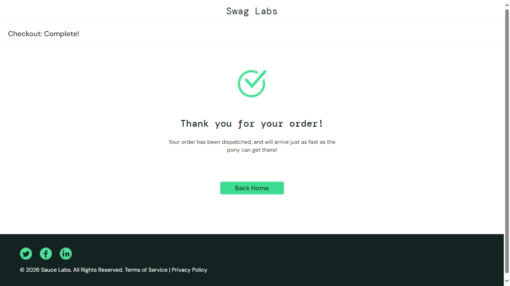

# 接口自动化测试项目（API Test Demo）
基于 Python 实现的企业级接口自动化测试框架，可批量执行接口用例并自动生成可视化测试报告。

---

## 🛠️ 技术栈
| 技术/工具 | 用途 |
|---------|------|
| Python 3.x | 核心开发语言 |
| Pytest | 测试用例管理、执行框架 |
| Requests | 接口请求封装 |
| HTMLTestRunner | 自动化生成可视化测试报告 |
| Git + GitHub | 版本控制与项目托管 |

---

## 📁 项目结构
api_test/
├── test_case/ # 测试用例文件夹
│ └── test_api.py # 接口测试用例
├── report/ # 测试报告输出文件夹
│ └── report.html # 自动生成的 HTML 可视化报告
├── common/ # 公共方法封装
└── requirements.txt # 项目依赖

---

## ✨ 实现功能
1. 封装 GET/POST 请求方法，统一处理接口请求
2. 支持批量执行测试用例，自动统计用例通过率
3. 断言校验接口返回状态码、响应数据正确性
4. 执行完成自动生成HTML可视化测试报告，包含：
   - 用例执行总数、通过数、失败数
   - 每个用例的请求参数、响应结果
   - 失败用例的错误详情与定位

---

## 🚀 运行方式
```bash
# 1. 安装项目依赖
pip install pytest requests

# 2. 执行所有测试用例并生成报告
pytest test_all.py -v --html=report.html

📊 测试报告效果
执行完成后自动生成可视化测试报告，展示完整的测试结果统计


## Web 自动化测试

对 [SauceDemo](https://www.saucedemo.com) 电商网站进行完整购物流程自动化测试。

### 测试场景
- 登录（标准用户 `standard_user`）
- 添加商品到购物车
- 进入购物车并结算
- 填写收货信息
- 完成订单并断言成功

### 技术栈
- Python + Playwright + pytest

### 运行方式
```bash
# 安装 Playwright 浏览器（首次）
playwright install chromium

# 运行 Web 自动化测试
pytest test_saucedemo_pytest.py -v --html=web_report.html
````

# 运行 Web 自动化测试
pytest test_saucedemo_pytest.py -v --html=web_report.html

执行效果截图


项目总结
接口自动化：覆盖 REST API 的 CRUD 操作，生成 HTML 报告
Web 自动化：模拟真实用户购物流程，验证核心业务路径


